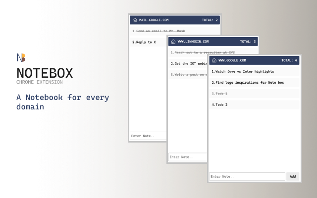

## Note Box - Chrome Extension
A Chrome extension to store notes for every domain

A Chrome Extension that provides a "notes container" for every domain. Add unlimed notes, along with an option to mark that item as `DONE`. Notes/Todos gets added based on the URL. Revisit the same note list when back to that URL or access all the notes from the Homepage.   No Login/Signup.  All the notes are stored in the browser memory.

**Notes are stored in browser memory** 

[Download URL](https://chrome.google.com/webstore/detail/note-box/mbbajjgefpenmkkhcnmmnoodlbcbfnmp) • [Youtube](https://youtu.be/fX3IKhiEz1s) • [Product Page](https://www.codedrops.tech/products/note-box)

### Features - v1 (Released)
- [x] Save Notes based on domain
- [x] View notes of all domain
- [x] Mark item as **done**

### Upcoming Features - v2
- [ ] Export notes (JSON)
- [ ] Filters 
  - [ ] Search
  - [ ] Sort by task status, name, creation date
- [ ] Show creation date for every item
- [ ] Categorize notes by domain paths
