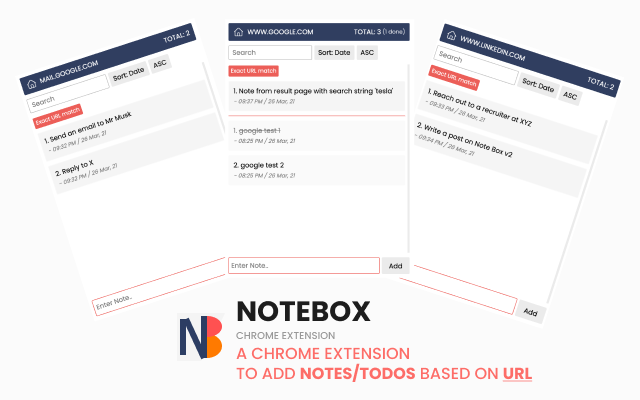

### Note Box - Chrome Extension
**A chrome extension to add notes/todos based on URL**

[Download URL](https://chrome.google.com/webstore/detail/note-box/mbbajjgefpenmkkhcnmmnoodlbcbfnmp) • [Youtube](https://youtu.be/fX3IKhiEz1s) • [Product Page](https://www.codedrops.tech/products/note-box)

> A Chrome Extension that provides an environment for every domain/URL. Revisit the notes when back to that URL or access it from `Home`.
  No Login/Signup.  All the notes are stored in the browser memory.

**Notes are stored in browser memory** 

### Features - v1 (Released)
- [x] View/Save notes based on domain
- [x] Mark item as **done**

### Upcoming Features - v2
- [ ] Export notes (JSON, CSV)
- [ ] Add Filters
  - [ ] Search
  - [ ] Sort (task status, name, creation date)
- [ ] Update card to show creation date
- [ ] View/Save notes based on paths
